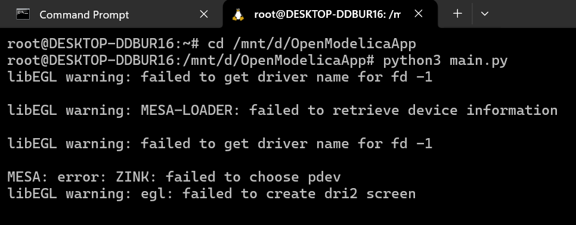
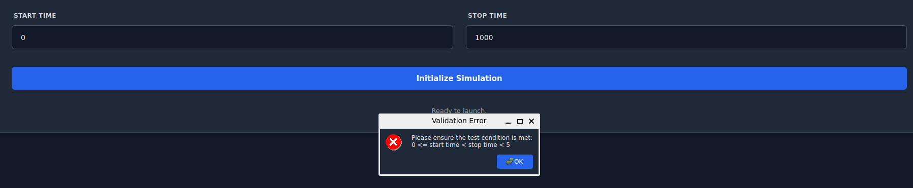
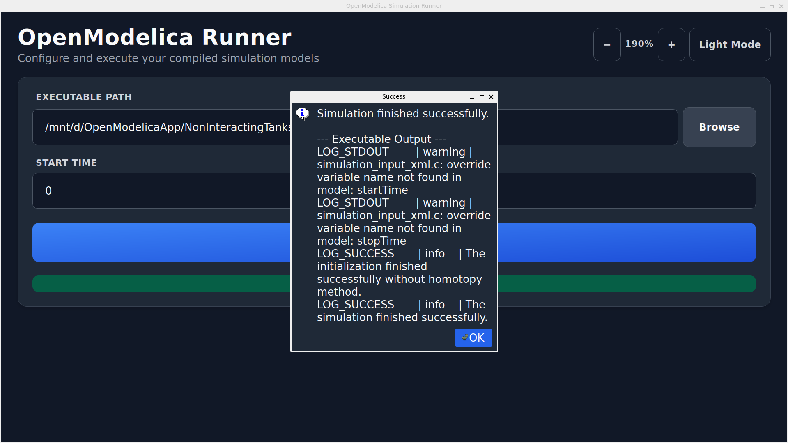
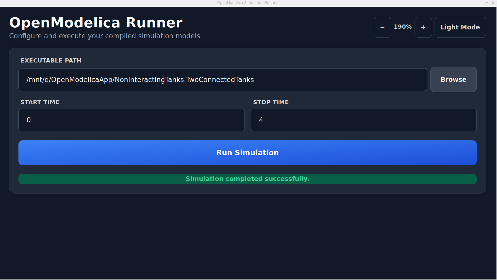

# OpenModelica Simulation Runner

A professional desktop application built with Python and PyQt6 for configuring and executing OpenModelica simulation executables.

This project was developed as part of the OpenModelica Screening Task (Stage 1).

## 🚀 Purpose of Application
The primary goal of this application is to provide an intuitive Graphical User Interface (GUI) to run an OpenModelica-generated executable model (`TwoConnectedTanks.exe`). The application allows the user to dynamically pass simulation parameters (Start Time and Stop Time) to the executable without needing to recompile the model or use a command-line interface.

## 🛠️ Methodology & Technologies
The application is built adhering strictly to Object-Oriented Programming (OOP) concepts and PEP-8 Python coding standards.
- **Language**: Python 3.6+
- **GUI Framework**: PyQt6
- **Simulation Tool**: OpenModelica
- **Design Pattern**: Object-Oriented (`QWidget` inheritance)
- **Sub-processing**: Uses `PyQt6.QtCore.QProcess` to run the OpenModelica executable in an asynchronous, non-blocking background process to keep the UI responsive.

## 📋 Features
- **Dynamic File Selection**: A browse button to select the target `.exe` file via native OS dialogs.
- **Input Validation**: Ensures inputs strictly follow the condition: `0 <= start time < stop time < 5`.
- **Modern UI/UX**: Features a meticulously designed, clean, light-themed interface with drop shadows, soft borders, and premium typography.
- **Real-Time Feedback**: UI elements (buttons/status labels) provide real-time updates regarding the simulation execution status (Running, Success, Error).

## 📸 Screenshots

| Light Mode (Idle) | Light Mode (Success) |
|:---:|:---:|
|  |  |

| Dark Mode (Zoomed) | File Browser Dialog |
|:---:|:---:|
|  |  |

<br>

## ⚙️ Installation & Usage

1. **Clone the repository**
   ```bash
   git clone https://github.com/akashkeote/OpenModelica.git
   cd OpenModelica
   ```

2. **Install Dependencies**
   Ensure you have Python 3.6+ installed. Install PyQt6 using pip:
   ```bash
   pip install PyQt6
   ```

3. **Run the Application**
   ```bash
   python main.py
   ```

4. **Execution Steps**
   - Click **Browse** and select the compiled OpenModelica executable (e.g., `TwoConnectedTanks.exe`).
   - Enter a **Start Time** (e.g., 0).
   - Enter a **Stop Time** (e.g., 4).
   - Click **Initialize Simulation**.
   - The application will execute the simulation and display the status at the bottom.

## 📝 Code Structure
- `main.py`: The entry point and complete GUI implementation containing the `OpenModelicaRunnerApp` class.
- `TwoConnectedTanks.exe`: (Optional) The compiled mock/real model executable used for testing.

---
*Submitted for the FOSSEE OpenModelica Screening Task.*
